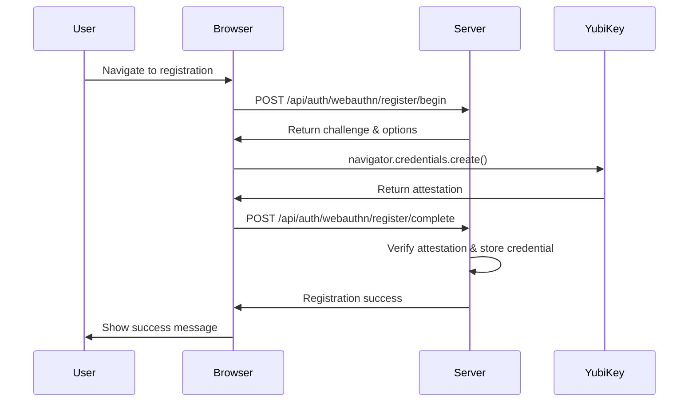
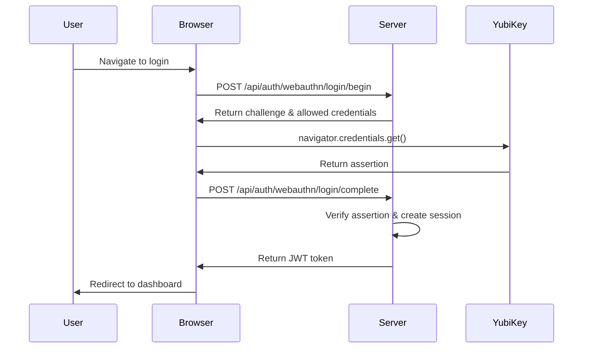
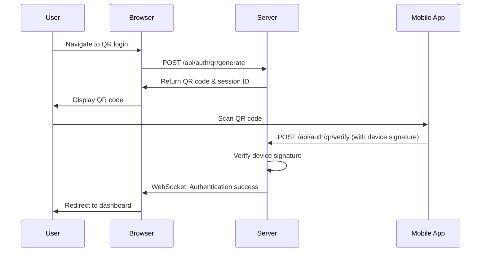

# YuBlog Technical Design Document

## Table of Contents

1. [System Architecture](#system-architecture)
2. [API Specifications](#api-specifications)
3. [Database Schema](#database-schema)
4. [Security Implementation](#security-implementation)
5. [Authentication Flows](#authentication-flows)
6. [Deployment Architecture](#deployment-architecture)
7. [Scalability & Maintenance](#scalability--maintenance)

## System Architecture

### High-Level Architecture

```
┌─────────────────┐    ┌─────────────────┐    ┌─────────────────┐
│   Web Browser   │    │  Mobile Device  │    │    YubiKey     │
│   (Frontend)    │    │ (QR Auth App)   │    │  (FIDO2/U2F)   │
└─────────┬───────┘    └─────────┬───────┘    └─────────┬───────┘
          │ HTTPS/WSS            │ HTTPS/WSS            │ USB/NFC
          │                      │                      │
    ┌─────▼──────────────────────▼──────────────────────▼─────┐
    │                 API Gateway                            │
    │           (Nginx + Rate Limiting)                      │
    └─────┬──────────────────────────────────────────────────┘
          │ Internal Network
    ┌─────▼─────┐  ┌─────────────┐  ┌──────────────┐  ┌─────────────┐
    │   Flask   │  │   Redis     │  │ PostgreSQL   │  │   File      │
    │ API Server│  │ (Sessions/  │  │ (Primary DB) │  │ Storage     │
    │           │  │  Cache)     │  │              │  │ (Media)     │
    └───────────┘  └─────────────┘  └──────────────┘  └─────────────┘
```

### Component Details

#### Frontend (React SPA)
- **Framework**: React 18 with TypeScript
- **Security**: CSP headers, XSS protection, secure cookie handling
- **Authentication**: WebAuthn API integration, QR code generation
- **Communication**: HTTPS-only, WebSocket for real-time features

#### Backend (Flask API)
- **Framework**: Flask with security extensions
- **Authentication**: WebAuthn server, JWT tokens, device management
- **Security**: Input validation, SQL injection prevention, rate limiting
- **Features**: Blog CRUD, user management, authentication APIs

#### Database (PostgreSQL)
- **Encryption**: AES-256 encryption at rest
- **Access**: Connection pooling, principle of least privilege
- **Backup**: Automated encrypted backups
- **Monitoring**: Query logging for security analysis

#### Security Zones

```
┌─────────────────────────────────────────────────────────────┐
│                      DMZ Zone                              │
│  ┌─────────────────┐  ┌─────────────────────────────────┐  │
│  │   API Gateway   │  │      Static File Server         │  │
│  │   (Nginx)       │  │      (Nginx)                    │  │
│  └─────────────────┘  └─────────────────────────────────┘  │
└─────────────────────────────────────────────────────────────┘
                              │
┌─────────────────────────────▼───────────────────────────────┐
│                  Application Zone                          │
│  ┌─────────────────┐  ┌─────────────────────────────────┐  │
│  │  Flask App      │  │      Redis Cache               │  │
│  │  (API Server)   │  │      (Session Store)           │  │
│  └─────────────────┘  └─────────────────────────────────┘  │
└─────────────────────────────────────────────────────────────┘
                              │
┌─────────────────────────────▼───────────────────────────────┐
│                    Data Zone                               │
│  ┌─────────────────┐  ┌─────────────────────────────────┐  │
│  │  PostgreSQL     │  │      File Storage               │  │
│  │  (Primary DB)   │  │      (Encrypted)                │  │
│  └─────────────────┘  └─────────────────────────────────┘  │
└─────────────────────────────────────────────────────────────┘
```

## API Specifications

### Authentication Endpoints

#### YubiKey Authentication

```http
POST /api/auth/webauthn/register/begin
Content-Type: application/json

{
  "username": "user@example.com"
}

Response:
{
  "challenge": "base64-encoded-challenge",
  "rp": {
    "name": "YuBlog",
    "id": "yourdomain.com"
  },
  "user": {
    "id": "base64-user-id",
    "name": "user@example.com",
    "displayName": "User Name"
  },
  "pubKeyCredParams": [...],
  "timeout": 60000,
  "attestation": "direct"
}
```

```http
POST /api/auth/webauthn/register/complete
Content-Type: application/json

{
  "id": "credential-id",
  "rawId": "base64-raw-id",
  "response": {
    "attestationObject": "base64-attestation",
    "clientDataJSON": "base64-client-data"
  },
  "type": "public-key"
}

Response:
{
  "success": true,
  "message": "YubiKey registered successfully"
}
```

```http
POST /api/auth/webauthn/login/begin
Content-Type: application/json

{
  "username": "user@example.com"
}

Response:
{
  "challenge": "base64-challenge",
  "rpId": "yourdomain.com",
  "allowCredentials": [
    {
      "type": "public-key",
      "id": "base64-credential-id"
    }
  ],
  "timeout": 60000
}
```

```http
POST /api/auth/webauthn/login/complete
Content-Type: application/json

{
  "id": "credential-id",
  "rawId": "base64-raw-id",
  "response": {
    "authenticatorData": "base64-auth-data",
    "signature": "base64-signature",
    "clientDataJSON": "base64-client-data"
  },
  "type": "public-key"
}

Response:
{
  "success": true,
  "token": "jwt-token",
  "user": {
    "id": "user-id",
    "username": "user@example.com"
  }
}
```

#### QR Code Authentication

```http
POST /api/auth/qr/generate
Content-Type: application/json
Authorization: Bearer <jwt-token>

{
  "deviceName": "iPhone 13"
}

Response:
{
  "qrCode": "data:image/png;base64,...",
  "sessionId": "unique-session-id",
  "expiresAt": "2024-01-01T12:00:00Z"
}
```

```http
POST /api/auth/qr/verify
Content-Type: application/json

{
  "sessionId": "unique-session-id",
  "deviceSignature": "base64-signature"
}

Response:
{
  "success": true,
  "token": "jwt-token",
  "user": {
    "id": "user-id",
    "username": "user@example.com"
  }
}
```

#### Device Management

```http
GET /api/auth/devices
Authorization: Bearer <jwt-token>

Response:
{
  "devices": [
    {
      "id": "device-id",
      "name": "iPhone 13",
      "type": "mobile",
      "lastUsed": "2024-01-01T12:00:00Z",
      "registered": "2024-01-01T10:00:00Z"
    }
  ]
}
```

```http
DELETE /api/auth/devices/{device-id}
Authorization: Bearer <jwt-token>

Response:
{
  "success": true,
  "message": "Device removed successfully"
}
```

### Blog Endpoints

```http
GET /api/posts
Authorization: Bearer <jwt-token>
Query Parameters: ?page=1&limit=10&search=query

Response:
{
  "posts": [
    {
      "id": "post-id",
      "title": "Post Title",
      "slug": "post-title",
      "excerpt": "Post excerpt...",
      "content": "Full post content...",
      "author": "user@example.com",
      "createdAt": "2024-01-01T12:00:00Z",
      "updatedAt": "2024-01-01T12:00:00Z",
      "published": true,
      "tags": ["tech", "security"]
    }
  ],
  "pagination": {
    "page": 1,
    "limit": 10,
    "total": 25,
    "pages": 3
  }
}
```

```http
POST /api/posts
Authorization: Bearer <jwt-token>
Content-Type: application/json

{
  "title": "New Post Title",
  "content": "Full post content...",
  "published": true,
  "tags": ["tech", "security"]
}

Response:
{
  "success": true,
  "post": {
    "id": "new-post-id",
    "title": "New Post Title",
    "slug": "new-post-title",
    "content": "Full post content...",
    "author": "user@example.com",
    "createdAt": "2024-01-01T12:00:00Z",
    "published": true,
    "tags": ["tech", "security"]
  }
}
```

## Database Schema

### Entity Relationship Diagram

```
┌─────────────────┐    ┌─────────────────┐    ┌─────────────────┐
│      Users      │    │   Credentials   │    │     Devices     │
├─────────────────┤    ├─────────────────┤    ├─────────────────┤
│ id (UUID) PK    │    │ id (UUID) PK    │    │ id (UUID) PK    │
│ username        │◄──►│ user_id FK      │    │ user_id FK      │◄──┐
│ email           │    │ credential_id   │    │ device_name     │   │
│ display_name    │    │ public_key      │    │ device_type     │   │
│ created_at      │    │ counter         │    │ public_key      │   │
│ updated_at      │    │ created_at      │    │ last_used       │   │
│ is_active       │    │ last_used       │    │ push_token      │   │
└─────────────────┘    └─────────────────┘    │ created_at      │   │
                                              │ is_active       │   │
                                              └─────────────────┘   │
                                                                    │
┌─────────────────┐    ┌─────────────────┐    ┌─────────────────┐   │
│      Posts      │    │   Post_Tags     │    │      Tags       │   │
├─────────────────┤    ├─────────────────┤    ├─────────────────┤   │
│ id (UUID) PK    │    │ post_id FK      │    │ id (UUID) PK    │   │
│ title           │◄──►│ tag_id FK       │◄──►│ name            │   │
│ slug            │    └─────────────────┘    │ created_at      │   │
│ content         │                           └─────────────────┘   │
│ excerpt         │                                                 │
│ author_id FK    │◄────────────────────────────────────────────────┘
│ published       │
│ created_at      │    ┌─────────────────┐
│ updated_at      │    │    Sessions     │
└─────────────────┘    ├─────────────────┤
                       │ id (UUID) PK    │
                       │ user_id FK      │
                       │ token_hash      │
                       │ device_id FK    │
                       │ expires_at      │
                       │ created_at      │
                       │ last_activity   │
                       │ ip_address      │
                       │ user_agent      │
                       └─────────────────┘
```

### Schema Definitions

```sql
-- Users table with encrypted PII
CREATE TABLE users (
    id UUID PRIMARY KEY DEFAULT gen_random_uuid(),
    username VARCHAR(255) UNIQUE NOT NULL,
    email VARCHAR(255) UNIQUE NOT NULL,
    display_name VARCHAR(255) NOT NULL,
    created_at TIMESTAMP WITH TIME ZONE DEFAULT NOW(),
    updated_at TIMESTAMP WITH TIME ZONE DEFAULT NOW(),
    is_active BOOLEAN DEFAULT TRUE,
    
    -- Encryption for PII
    CONSTRAINT valid_email CHECK (email ~* '^[A-Za-z0-9._%+-]+@[A-Za-z0-9.-]+\.[A-Za-z]{2,}$')
);

-- WebAuthn credentials
CREATE TABLE credentials (
    id UUID PRIMARY KEY DEFAULT gen_random_uuid(),
    user_id UUID NOT NULL REFERENCES users(id) ON DELETE CASCADE,
    credential_id TEXT UNIQUE NOT NULL,
    public_key TEXT NOT NULL,
    counter BIGINT DEFAULT 0,
    created_at TIMESTAMP WITH TIME ZONE DEFAULT NOW(),
    last_used TIMESTAMP WITH TIME ZONE,
    device_name VARCHAR(255),
    
    INDEX idx_credential_id (credential_id),
    INDEX idx_user_credentials (user_id)
);

-- Registered devices for QR auth
CREATE TABLE devices (
    id UUID PRIMARY KEY DEFAULT gen_random_uuid(),
    user_id UUID NOT NULL REFERENCES users(id) ON DELETE CASCADE,
    device_name VARCHAR(255) NOT NULL,
    device_type VARCHAR(50) NOT NULL, -- 'mobile', 'tablet', etc.
    public_key TEXT NOT NULL,
    push_token TEXT, -- For push notifications
    last_used TIMESTAMP WITH TIME ZONE,
    created_at TIMESTAMP WITH TIME ZONE DEFAULT NOW(),
    is_active BOOLEAN DEFAULT TRUE,
    
    INDEX idx_user_devices (user_id)
);

-- Blog posts
CREATE TABLE posts (
    id UUID PRIMARY KEY DEFAULT gen_random_uuid(),
    title VARCHAR(500) NOT NULL,
    slug VARCHAR(500) UNIQUE NOT NULL,
    content TEXT NOT NULL,
    excerpt TEXT,
    author_id UUID NOT NULL REFERENCES users(id) ON DELETE CASCADE,
    published BOOLEAN DEFAULT FALSE,
    created_at TIMESTAMP WITH TIME ZONE DEFAULT NOW(),
    updated_at TIMESTAMP WITH TIME ZONE DEFAULT NOW(),
    
    INDEX idx_published_posts (published, created_at DESC),
    INDEX idx_author_posts (author_id, created_at DESC),
    INDEX idx_post_slug (slug)
);

-- Tags
CREATE TABLE tags (
    id UUID PRIMARY KEY DEFAULT gen_random_uuid(),
    name VARCHAR(100) UNIQUE NOT NULL,
    created_at TIMESTAMP WITH TIME ZONE DEFAULT NOW(),
    
    INDEX idx_tag_name (name)
);

-- Post-Tag relationships
CREATE TABLE post_tags (
    post_id UUID NOT NULL REFERENCES posts(id) ON DELETE CASCADE,
    tag_id UUID NOT NULL REFERENCES tags(id) ON DELETE CASCADE,
    PRIMARY KEY (post_id, tag_id)
);

-- Secure session management
CREATE TABLE sessions (
    id UUID PRIMARY KEY DEFAULT gen_random_uuid(),
    user_id UUID NOT NULL REFERENCES users(id) ON DELETE CASCADE,
    token_hash VARCHAR(255) UNIQUE NOT NULL,
    device_id UUID REFERENCES devices(id) ON DELETE SET NULL,
    expires_at TIMESTAMP WITH TIME ZONE NOT NULL,
    created_at TIMESTAMP WITH TIME ZONE DEFAULT NOW(),
    last_activity TIMESTAMP WITH TIME ZONE DEFAULT NOW(),
    ip_address INET,
    user_agent TEXT,
    
    INDEX idx_token_hash (token_hash),
    INDEX idx_user_sessions (user_id, expires_at),
    INDEX idx_session_cleanup (expires_at)
);

-- Audit logs for security monitoring
CREATE TABLE audit_logs (
    id UUID PRIMARY KEY DEFAULT gen_random_uuid(),
    user_id UUID REFERENCES users(id) ON DELETE SET NULL,
    action VARCHAR(100) NOT NULL,
    resource_type VARCHAR(50),
    resource_id UUID,
    details JSONB,
    ip_address INET,
    user_agent TEXT,
    success BOOLEAN NOT NULL,
    created_at TIMESTAMP WITH TIME ZONE DEFAULT NOW(),
    
    INDEX idx_user_audits (user_id, created_at DESC),
    INDEX idx_action_audits (action, created_at DESC),
    INDEX idx_audit_timeline (created_at DESC)
);
```

## Security Implementation

### No Password Storage

**Implementation**: The system uses exclusively public key cryptography:
- **WebAuthn**: Public key credentials stored, private keys remain on YubiKey
- **QR Auth**: Device public keys stored, private keys remain on mobile device
- **Zero Password Policy**: No password fields, hashing algorithms, or password-related code

### End-to-End Encryption

**TLS 1.3 Configuration**:
```nginx
ssl_protocols TLSv1.3;
ssl_ciphers ECDHE-ECDSA-AES256-GCM-SHA384:ECDHE-RSA-AES256-GCM-SHA384;
ssl_prefer_server_ciphers off;
ssl_session_cache shared:SSL:10m;
ssl_session_timeout 10m;
```

**Database Encryption**: AES-256 encryption at rest with key rotation
**API Communication**: HTTPS-only with certificate pinning

### Input Validation & Sanitization

**Backend Validation**:
```python
from marshmallow import Schema, fields, validate
from bleach import clean

class PostSchema(Schema):
    title = fields.Str(required=True, validate=validate.Length(max=500))
    content = fields.Str(required=True, validate=validate.Length(max=50000))
    tags = fields.List(fields.Str(validate=validate.Length(max=50)), missing=[])
    
    def load(self, json_data, *args, **kwargs):
        data = super().load(json_data, *args, **kwargs)
        # Sanitize HTML content
        data['content'] = clean(data['content'], 
            tags=['p', 'br', 'strong', 'em', 'ul', 'ol', 'li', 'a', 'h1', 'h2', 'h3'],
            attributes={'a': ['href']})
        return data
```

### Secure Session Management

**JWT Configuration**:
```python
JWT_SECRET_KEY = os.environ['JWT_SECRET_KEY']  # 256-bit key
JWT_ALGORITHM = 'HS256'
JWT_ACCESS_TOKEN_EXPIRES = timedelta(hours=1)
JWT_REFRESH_TOKEN_EXPIRES = timedelta(days=30)

# Security headers
app.config.update(
    SESSION_COOKIE_SECURE=True,
    SESSION_COOKIE_HTTPONLY=True,
    SESSION_COOKIE_SAMESITE='Strict',
    PERMANENT_SESSION_LIFETIME=timedelta(hours=24)
)
```

### Rate Limiting

**Implementation**:
```python
from flask_limiter import Limiter
from flask_limiter.util import get_remote_address

limiter = Limiter(
    app,
    key_func=get_remote_address,
    default_limits=["1000 per hour"],
    storage_uri="redis://localhost:6379"
)

# Auth endpoints
@app.route('/api/auth/webauthn/login/begin', methods=['POST'])
@limiter.limit("5 per minute")
def webauthn_login_begin():
    pass

@app.route('/api/auth/qr/generate', methods=['POST'])
@limiter.limit("3 per minute")
def qr_generate():
    pass
```

### Content Security Policy

**CSP Header**:
```
Content-Security-Policy: 
  default-src 'self'; 
  script-src 'self' 'unsafe-inline'; 
  style-src 'self' 'unsafe-inline'; 
  img-src 'self' data: https:; 
  font-src 'self'; 
  connect-src 'self' wss:; 
  frame-ancestors 'none'; 
  base-uri 'self'; 
  form-action 'self'
```

### OWASP Top 10 Mitigation

1. **Broken Access Control**: JWT validation, role-based permissions
2. **Cryptographic Failures**: TLS 1.3, AES-256, secure key management
3. **Injection**: Parameterized queries, input validation, ORM usage
4. **Insecure Design**: Security by design, threat modeling
5. **Security Misconfiguration**: Secure defaults, automated security testing
6. **Vulnerable Components**: Dependency scanning, regular updates
7. **Authentication Failures**: WebAuthn, device-based auth, no passwords
8. **Software Integrity**: Code signing, SRI for frontend assets
9. **Logging Failures**: Comprehensive audit logging, security monitoring
10. **SSRF**: URL validation, allowlist of external services

## Authentication Flows

### YubiKey Registration Flow



### YubiKey Authentication Flow



### QR Code Authentication Flow



## Deployment Architecture

### Docker Composition

```yaml
version: '3.8'
services:
  nginx:
    image: nginx:alpine
    ports:
      - "443:443"
      - "80:80"
    volumes:
      - ./nginx.conf:/etc/nginx/nginx.conf
      - ./ssl:/etc/ssl/certs
    networks:
      - frontend

  app:
    build: ./backend
    environment:
      - DATABASE_URL=postgresql://user:pass@db:5432/yublog
      - REDIS_URL=redis://redis:6379/0
      - JWT_SECRET_KEY=${JWT_SECRET_KEY}
    networks:
      - frontend
      - backend

  db:
    image: postgres:15-alpine
    environment:
      - POSTGRES_DB=yublog
      - POSTGRES_USER=yublog
      - POSTGRES_PASSWORD=${DB_PASSWORD}
    volumes:
      - postgres_data:/var/lib/postgresql/data
      - ./database/init.sql:/docker-entrypoint-initdb.d/init.sql
    networks:
      - backend

  redis:
    image: redis:7-alpine
    command: redis-server --requirepass ${REDIS_PASSWORD}
    networks:
      - backend

networks:
  frontend:
  backend:
    internal: true

volumes:
  postgres_data:
```

## Scalability & Maintenance

### Horizontal Scaling
- **Load Balancing**: Nginx with multiple Flask instances
- **Database**: Read replicas for scaling reads
- **Caching**: Redis for session storage and query caching
- **CDN**: Static asset distribution

### Security Updates
- **Automated Scanning**: Dependency vulnerability scanning
- **Update Process**: Blue-green deployments for zero downtime
- **Monitoring**: Real-time security monitoring and alerting
- **Backup**: Encrypted automated backups with point-in-time recovery

### Monitoring & Observability
- **Metrics**: Application performance monitoring
- **Logs**: Centralized logging with security event correlation
- **Alerts**: Automated security incident response
- **Health Checks**: Comprehensive system health monitoring 