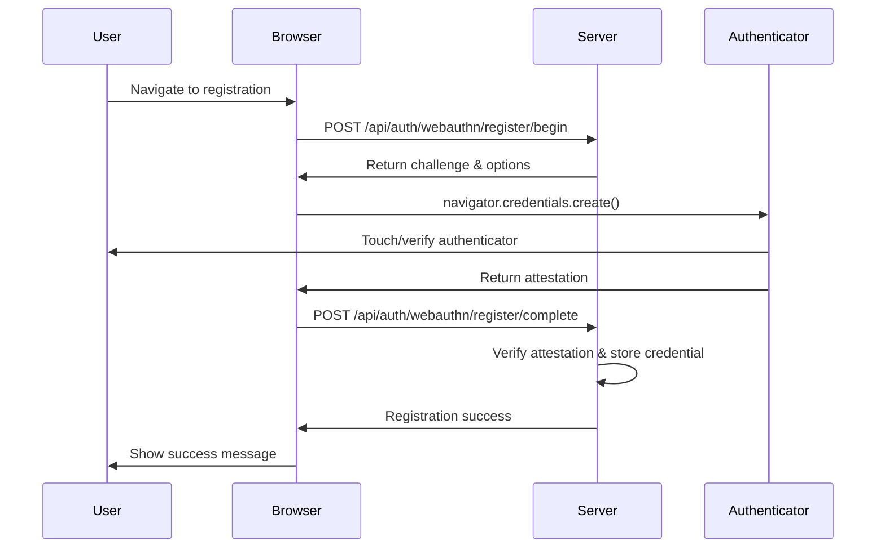
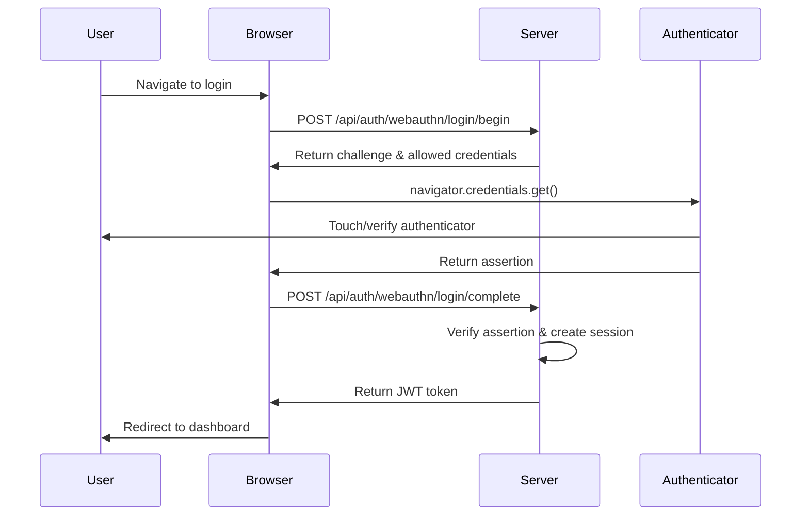

# YuBlog Technical Design Document

## Table of Contents

1. [System Architecture](#system-architecture)
2. [API Specifications](#api-specifications)
3. [Database Schema](#database-schema)
4. [Security Implementation](#security-implementation)
5. [Authentication Flows](#authentication-flows)
6. [Deployment Architecture](#deployment-architecture)
7. [Scalability & Maintenance](#scalability--maintenance)

## System Architecture

### High-Level Architecture

```
┌─────────────────┐    ┌─────────────────┐
│   Web Browser   │    │    YubiKey     │
│   (Frontend)    │    │  (FIDO2/U2F)   │
└─────────┬───────┘    └─────────┬───────┘
          │ HTTPS              │ USB/NFC/BLE
          │                    │
    ┌─────▼────────────────────▼─────┐
    │         API Gateway            │
    │   (Nginx + Rate Limiting)      │
    └─────┬──────────────────────────┘
          │ Internal Network
    ┌─────▼─────┐  ┌─────────────┐  ┌──────────────┐  ┌─────────────┐
    │ Express.js│  │   Redis     │  │ PostgreSQL   │  │   File      │
    │API Server │  │ (Sessions/  │  │ (Primary DB) │  │ Storage     │
    │(Node.js)  │  │  Cache)     │  │              │  │ (Media)     │
    └───────────┘  └─────────────┘  └──────────────┘  └─────────────┘
```

### Component Details

#### Frontend (React SPA)
- **Framework**: React 18 with modern JavaScript
- **Security**: CSP headers, XSS protection, secure cookie handling
- **Authentication**: WebAuthn API integration for hardware security keys
- **Communication**: HTTPS-only, secure API communication
- **Features**: Blog management, user profile, responsive design

#### Backend (Express.js API)
- **Framework**: Express.js with security middleware (primary) + Flask alternative
- **Authentication**: Native WebAuthn server implementation (no external libraries), JWT tokens
- **Security**: Input validation, SQL injection prevention, rate limiting, Helmet.js
- **Features**: Blog CRUD operations, user management, authentication APIs
- **WebAuthn**: Custom CBOR decoding, COSE key handling, native crypto verification
- **Future**: QR code authentication APIs (backend implemented, frontend pending)

#### Database (PostgreSQL)
- **Encryption**: AES-256 encryption at rest
- **Access**: Connection pooling, principle of least privilege
- **Backup**: Automated encrypted backups
- **Monitoring**: Query logging for security analysis

#### Security Zones

```
┌─────────────────────────────────────────────────────────────┐
│                      DMZ Zone                              │
│  ┌─────────────────┐  ┌─────────────────────────────────┐  │
│  │   API Gateway   │  │      Static File Server         │  │
│  │   (Nginx)       │  │      (Nginx)                    │  │
│  └─────────────────┘  └─────────────────────────────────┘  │
└─────────────────────────────────────────────────────────────┘
                              │
┌─────────────────────────────▼───────────────────────────────┐
│                  Application Zone                          │
│  ┌─────────────────┐  ┌─────────────────────────────────┐  │
│  │ Express.js App  │  │      Redis Cache               │  │
│  │ (API Server)    │  │      (Session Store)           │  │
│  └─────────────────┘  └─────────────────────────────────┘  │
└─────────────────────────────────────────────────────────────┘
                              │
┌─────────────────────────────▼───────────────────────────────┐
│                    Data Zone                               │
│  ┌─────────────────┐  ┌─────────────────────────────────┐  │
│  │  PostgreSQL     │  │      File Storage               │  │
│  │  (Primary DB)   │  │      (Encrypted)                │  │
│  └─────────────────┘  └─────────────────────────────────┘  │
└─────────────────────────────────────────────────────────────┘
```

## API Specifications

### Authentication Endpoints

#### WebAuthn/FIDO2 Authentication (Currently Implemented - Express.js)

The primary backend uses a **native WebAuthn implementation** built from scratch without external libraries, featuring:
- Custom CBOR-X decoding for authenticator data
- Native COSE key format handling  
- Built-in crypto verification using Node.js crypto module
- Support for ES256, RS256, and PS256 algorithms
- Direct WebAuthn specification compliance

**Registration Flow:**

```http
POST /api/auth/webauthn/register/begin
Content-Type: application/json

{
  "username": "user@example.com"
}

Response:
{
  "challenge": "base64-encoded-challenge",
  "rp": {
    "name": "YuBlog",
    "id": "yourdomain.com"
  },
  "user": {
    "id": "base64-user-id",
    "name": "user@example.com",
    "displayName": "User Name"
  },
  "pubKeyCredParams": [...],
  "timeout": 60000,
  "attestation": "direct"
}
```

```http
POST /api/auth/webauthn/register/complete
Content-Type: application/json

{
  "id": "credential-id",
  "rawId": "base64-raw-id",
  "response": {
    "attestationObject": "base64-attestation",
    "clientDataJSON": "base64-client-data"
  },
  "type": "public-key"
}

Response:
{
  "success": true,
  "message": "Security key registered successfully"
}
```

**Authentication Flow:**

```http
POST /api/auth/webauthn/login/begin
Content-Type: application/json

{
  "username": "user@example.com"
}

Response:
{
  "challenge": "base64-challenge",
  "rpId": "yourdomain.com",
  "allowCredentials": [
    {
      "type": "public-key",
      "id": "base64-credential-id"
    }
  ],
  "timeout": 60000
}
```

```http
POST /api/auth/webauthn/login/complete
Content-Type: application/json

{
  "id": "credential-id",
  "rawId": "base64-raw-id",
  "response": {
    "authenticatorData": "base64-auth-data",
    "signature": "base64-signature",
    "clientDataJSON": "base64-client-data"
  },
  "type": "public-key"
}

Response:
{
  "success": true,
  "token": "jwt-token",
  "user": {
    "id": "user-id",
    "username": "user@example.com"
  }
}
```

### Blog Management Endpoints (Currently Implemented)

```http
GET /api/posts
Authorization: Bearer <jwt-token>
Query Parameters: ?page=1&limit=10&search=query

Response:
{
  "posts": [
    {
      "id": "post-id",
      "title": "Post Title",
      "slug": "post-title",
      "excerpt": "Post excerpt...",
      "content": "Full post content...",
      "author": "user@example.com",
      "createdAt": "2024-01-01T12:00:00Z",
      "updatedAt": "2024-01-01T12:00:00Z",
      "published": true,
      "tags": ["tech", "security"]
    }
  ],
  "pagination": {
    "page": 1,
    "limit": 10,
    "total": 25,
    "pages": 3
  }
}
```

```http
POST /api/posts
Authorization: Bearer <jwt-token>
Content-Type: application/json

{
  "title": "New Post Title",
  "content": "Full post content...",
  "published": true,
  "tags": ["tech", "security"]
}

Response:
{
  "success": true,
  "post": {
    "id": "new-post-id",
    "title": "New Post Title",
    "slug": "new-post-title",
    "content": "Full post content...",
    "author": "user@example.com",
    "createdAt": "2024-01-01T12:00:00Z",
    "published": true,
    "tags": ["tech", "security"]
  }
}
```

## Database Schema

### Entity Relationship Diagram

```
┌─────────────────┐    ┌─────────────────┐    
│      Users      │    │   Credentials   │    
├─────────────────┤    ├─────────────────┤    
│ id (UUID) PK    │    │ id (UUID) PK    │    
│ username        │◄──►│ user_id FK      │    
│ email           │    │ credential_id   │    
│ display_name    │    │ public_key      │    
│ created_at      │    │ counter         │    
│ updated_at      │    │ created_at      │    
│ is_active       │    │ last_used       │    
└─────────────────┘    │ device_name     │    
                       └─────────────────┘    

┌─────────────────┐    ┌─────────────────┐    ┌─────────────────┐
│      Posts      │    │   Post_Tags     │    │      Tags       │
├─────────────────┤    ├─────────────────┤    ├─────────────────┤
│ id (UUID) PK    │    │ post_id FK      │    │ id (UUID) PK    │
│ title           │◄──►│ tag_id FK       │◄──►│ name            │
│ slug            │    └─────────────────┘    │ created_at      │
│ content         │                           └─────────────────┘
│ excerpt         │                                              
│ author_id FK    │◄─────────────────────────────────────────────┘
│ published       │
│ created_at      │    ┌─────────────────┐
│ updated_at      │    │    Sessions     │
└─────────────────┘    ├─────────────────┤
                       │ id (UUID) PK    │
                       │ user_id FK      │
                       │ token_hash      │
                       │ credential_id   │
                       │ expires_at      │
                       │ created_at      │
                       │ last_activity   │
                       │ ip_address      │
                       │ user_agent      │
                       └─────────────────┘
```

### Schema Definitions

```sql
-- Users table with encrypted PII
CREATE TABLE users (
    id UUID PRIMARY KEY DEFAULT gen_random_uuid(),
    username VARCHAR(255) UNIQUE NOT NULL,
    email VARCHAR(255) UNIQUE NOT NULL,
    display_name VARCHAR(255) NOT NULL,
    created_at TIMESTAMP WITH TIME ZONE DEFAULT NOW(),
    updated_at TIMESTAMP WITH TIME ZONE DEFAULT NOW(),
    is_active BOOLEAN DEFAULT TRUE,
    
    -- Encryption for PII
    CONSTRAINT valid_email CHECK (email ~* '^[A-Za-z0-9._%+-]+@[A-Za-z0-9.-]+\.[A-Za-z]{2,}$')
);

-- WebAuthn credentials (YubiKey, Touch ID, Windows Hello, etc.)
CREATE TABLE credentials (
    id UUID PRIMARY KEY DEFAULT gen_random_uuid(),
    user_id UUID NOT NULL REFERENCES users(id) ON DELETE CASCADE,
    credential_id TEXT UNIQUE NOT NULL,
    public_key TEXT NOT NULL,
    counter BIGINT DEFAULT 0,
    created_at TIMESTAMP WITH TIME ZONE DEFAULT NOW(),
    last_used TIMESTAMP WITH TIME ZONE,
    device_name VARCHAR(255), -- e.g., "YubiKey 5C", "Touch ID", "Windows Hello"
    authenticator_type VARCHAR(50), -- 'security_key', 'platform', 'hybrid'
    
    INDEX idx_credential_id (credential_id),
    INDEX idx_user_credentials (user_id)
);

-- Blog posts
CREATE TABLE posts (
    id UUID PRIMARY KEY DEFAULT gen_random_uuid(),
    title VARCHAR(500) NOT NULL,
    slug VARCHAR(500) UNIQUE NOT NULL,
    content TEXT NOT NULL,
    excerpt TEXT,
    author_id UUID NOT NULL REFERENCES users(id) ON DELETE CASCADE,
    published BOOLEAN DEFAULT FALSE,
    created_at TIMESTAMP WITH TIME ZONE DEFAULT NOW(),
    updated_at TIMESTAMP WITH TIME ZONE DEFAULT NOW(),
    
    INDEX idx_published_posts (published, created_at DESC),
    INDEX idx_author_posts (author_id, created_at DESC),
    INDEX idx_post_slug (slug)
);

-- Tags
CREATE TABLE tags (
    id UUID PRIMARY KEY DEFAULT gen_random_uuid(),
    name VARCHAR(100) UNIQUE NOT NULL,
    created_at TIMESTAMP WITH TIME ZONE DEFAULT NOW(),
    
    INDEX idx_tag_name (name)
);

-- Post-Tag relationships
CREATE TABLE post_tags (
    post_id UUID NOT NULL REFERENCES posts(id) ON DELETE CASCADE,
    tag_id UUID NOT NULL REFERENCES tags(id) ON DELETE CASCADE,
    PRIMARY KEY (post_id, tag_id)
);

-- Secure session management
CREATE TABLE sessions (
    id UUID PRIMARY KEY DEFAULT gen_random_uuid(),
    user_id UUID NOT NULL REFERENCES users(id) ON DELETE CASCADE,
    token_hash VARCHAR(255) UNIQUE NOT NULL,
    credential_id TEXT REFERENCES credentials(credential_id) ON DELETE SET NULL,
    expires_at TIMESTAMP WITH TIME ZONE NOT NULL,
    created_at TIMESTAMP WITH TIME ZONE DEFAULT NOW(),
    last_activity TIMESTAMP WITH TIME ZONE DEFAULT NOW(),
    ip_address INET,
    user_agent TEXT,
    
    INDEX idx_token_hash (token_hash),
    INDEX idx_user_sessions (user_id, expires_at),
    INDEX idx_session_cleanup (expires_at)
);

-- Audit logs for security monitoring
CREATE TABLE audit_logs (
    id UUID PRIMARY KEY DEFAULT gen_random_uuid(),
    user_id UUID REFERENCES users(id) ON DELETE SET NULL,
    action VARCHAR(100) NOT NULL,
    resource_type VARCHAR(50),
    resource_id UUID,
    details JSONB,
    ip_address INET,
    user_agent TEXT,
    success BOOLEAN NOT NULL,
    created_at TIMESTAMP WITH TIME ZONE DEFAULT NOW(),
    
    INDEX idx_user_audits (user_id, created_at DESC),
    INDEX idx_action_audits (action, created_at DESC),
    INDEX idx_audit_timeline (created_at DESC)
);
```

## Security Implementation

### No Password Storage

**Implementation**: The system uses exclusively public key cryptography:
- **WebAuthn**: Public key credentials stored, private keys remain on hardware authenticators
- **Zero Password Policy**: No password fields, hashing algorithms, or password-related code
- **Hardware Security**: Private keys never leave the security key or platform authenticator

### End-to-End Encryption

**TLS 1.3 Configuration**:
```nginx
ssl_protocols TLSv1.3;
ssl_ciphers ECDHE-ECDSA-AES256-GCM-SHA384:ECDHE-RSA-AES256-GCM-SHA384;
ssl_prefer_server_ciphers off;
ssl_session_cache shared:SSL:10m;
ssl_session_timeout 10m;
```

**Database Encryption**: AES-256 encryption at rest with key rotation
**API Communication**: HTTPS-only with certificate pinning

### Input Validation & Sanitization

**Backend Validation** (Express.js with express-validator):
```javascript
import { body, validationResult } from 'express-validator';
import DOMPurify from 'dompurify';
import { JSDOM } from 'jsdom';

const window = new JSDOM('').window;
const purify = DOMPurify(window);

// User registration validation
const userRegistrationValidation = [
  body('username')
    .isLength({ min: 3, max: 50 })
    .matches(/^[A-Za-z0-9_-]+$/)
    .withMessage('Username must be 3-50 characters and contain only letters, numbers, hyphens, and underscores'),
  body('email')
    .optional()
    .isEmail()
    .withMessage('Must be a valid email address'),
  body('display_name')
    .optional()
    .isLength({ min: 1, max: 255 })
    .withMessage('Display name must be 1-255 characters')
];

// Post content validation with HTML sanitization
const postValidation = [
  body('title')
    .isLength({ min: 1, max: 500 })
    .withMessage('Title must be 1-500 characters'),
  body('content')
    .isLength({ min: 1, max: 50000 })
    .customSanitizer(value => {
      return purify.sanitize(value, {
        ALLOWED_TAGS: ['p', 'br', 'strong', 'em', 'ul', 'ol', 'li', 'a', 'h1', 'h2', 'h3'],
        ALLOWED_ATTR: ['href']
      });
    })
    .withMessage('Content must be 1-50000 characters')
];

// Validation error handler
function handleValidationErrors(req, res, next) {
  const errors = validationResult(req);
  if (!errors.isEmpty()) {
    return res.status(400).json({ 
      error: 'Validation failed', 
      details: errors.array() 
    });
  }
  next();
}
```

### Secure Session Management

**JWT Configuration** (Express.js):
```javascript
import jwt from 'jsonwebtoken';

const JWT_SECRET_KEY = process.env.JWT_SECRET_KEY; // 256-bit key
const JWT_ALGORITHM = 'HS256';
const JWT_ACCESS_TOKEN_EXPIRES = '1h';
const JWT_REFRESH_TOKEN_EXPIRES = '30d';

// JWT middleware
function authenticateToken(req, res, next) {
  const authHeader = req.headers['authorization'];
  const token = authHeader && authHeader.split(' ')[1];

  if (!token) {
    return res.status(401).json({ error: 'Access token required' });
  }

  jwt.verify(token, JWT_SECRET_KEY, (err, user) => {
    if (err) {
      return res.status(403).json({ error: 'Invalid or expired token' });
    }
    req.user = user;
    next();
  });
}

// Security headers configuration with Helmet.js
import helmet from 'helmet';

app.use(helmet({
  contentSecurityPolicy: {
    directives: {
      defaultSrc: ["'self'"],
      scriptSrc: ["'self'", "'unsafe-inline'"],
      styleSrc: ["'self'", "'unsafe-inline'"],
      imgSrc: ["'self'", "data:", "https:"],
      fontSrc: ["'self'"],
      connectSrc: ["'self'"],
      frameAncestors: ["'none'"],
    },
  },
  crossOriginEmbedderPolicy: false
}));
```

### Rate Limiting

**Implementation** (Express.js with express-rate-limit):
```javascript
import rateLimit from 'express-rate-limit';

// General rate limiting
const limiter = rateLimit({
  windowMs: 15 * 60 * 1000, // 15 minutes
  max: 100, // limit each IP to 100 requests per windowMs
  message: 'Too many requests from this IP, please try again later.'
});

// Strict rate limiting for auth endpoints
const strictLimiter = rateLimit({
  windowMs: 15 * 60 * 1000, // 15 minutes
  max: 50, // limit each IP to 50 requests per windowMs
  message: 'Too many authentication attempts, please try again later.'
});

app.use(limiter);

// Auth endpoints with strict limiting
app.post('/api/auth/webauthn/login/begin', strictLimiter, async (req, res) => {
  await beginAuthentication(req, res);
});

app.post('/api/auth/webauthn/register/begin', strictLimiter, async (req, res) => {
  await beginRegistration(req, res);
});
```

### Content Security Policy

**CSP Header**:
```
Content-Security-Policy: 
  default-src 'self'; 
  script-src 'self' 'unsafe-inline'; 
  style-src 'self' 'unsafe-inline'; 
  img-src 'self' data: https:; 
  font-src 'self'; 
  connect-src 'self'; 
  frame-ancestors 'none'; 
  base-uri 'self'; 
  form-action 'self'
```

### OWASP Top 10 Mitigation

1. **Broken Access Control**: JWT validation, role-based permissions
2. **Cryptographic Failures**: TLS 1.3, AES-256, secure key management
3. **Injection**: Parameterized queries, input validation, ORM usage
4. **Insecure Design**: Security by design, threat modeling
5. **Security Misconfiguration**: Secure defaults, automated security testing
6. **Vulnerable Components**: Dependency scanning, regular updates
7. **Authentication Failures**: WebAuthn, hardware-based auth, no passwords
8. **Software Integrity**: Code signing, SRI for frontend assets
9. **Logging Failures**: Comprehensive audit logging, security monitoring
10. **SSRF**: URL validation, allowlist of external services

## Authentication Flows

### WebAuthn Registration Flow (Currently Implemented)



### WebAuthn Authentication Flow (Currently Implemented)



### Supported Authenticators

- **Hardware Security Keys**: YubiKey 5 Series, SoloKeys, Google Titan
- **Platform Authenticators**: Touch ID (macOS), Windows Hello, Android Fingerprint
- **Cross-Platform**: Any FIDO2/WebAuthn compatible device

### Future Authentication (Backend APIs Ready)

The backend includes QR code authentication APIs for future mobile app implementation:
- QR code generation for session linkage
- Device registration and verification
- Push notification support
- Mobile app integration ready

## Deployment Architecture

### Docker Composition

```yaml
version: '3.8'
services:
  # Express.js Backend (Primary - Native WebAuthn)
  backend-js:
    build:
      context: ./backend-js
      dockerfile: Dockerfile
    container_name: yublog_backend_js
    environment:
      NODE_ENV: ${NODE_ENV:-production}
      PORT: 5000
      
      # Database Configuration
      DB_HOST: db
      DB_PORT: 5432
      DB_NAME: yublog
      DB_USER: yublog
      DB_PASSWORD: ${DB_PASSWORD:-CHANGE_ME_IN_PRODUCTION_123!}
      
      # Redis Configuration
      REDIS_URL: redis://:${REDIS_PASSWORD:-CHANGE_ME_IN_PRODUCTION_456!}@redis:6379
      
      # JWT Configuration
      JWT_SECRET_KEY: ${JWT_SECRET_KEY:-GENERATE_NEW_JWT_SECRET_FOR_PRODUCTION}
      
      # WebAuthn Configuration
      WEBAUTHN_RP_NAME: ${WEBAUTHN_RP_NAME:-YuBlog}
      WEBAUTHN_RP_ID: ${WEBAUTHN_RP_ID:-localhost}
      WEBAUTHN_ORIGIN: ${WEBAUTHN_ORIGIN:-https://localhost}
      
    depends_on:
      db:
        condition: service_healthy
      redis:
        condition: service_healthy
    networks:
      - frontend
      - backend
    restart: unless-stopped
    healthcheck:
      test: ["CMD", "wget", "--no-verbose", "--tries=1", "--spider", "http://localhost:5000/api/health"]
      interval: 30s
      timeout: 10s
      retries: 3

  # Flask Backend (Alternative - QR Code APIs)
  backend:
    build:
      context: ./backend
      dockerfile: Dockerfile
    container_name: yublog_backend_flask
    environment:
      DATABASE_URL: postgresql://yublog:${DB_PASSWORD:-CHANGE_ME_IN_PRODUCTION_123!}@db:5432/yublog
      REDIS_URL: redis://:${REDIS_PASSWORD:-CHANGE_ME_IN_PRODUCTION_456!}@redis:6379/0
      JWT_SECRET_KEY: ${JWT_SECRET_KEY:-GENERATE_NEW_JWT_SECRET_FOR_PRODUCTION}
      
      # WebAuthn Configuration
      WEBAUTHN_RP_ID: ${WEBAUTHN_RP_ID:-localhost}
      WEBAUTHN_RP_NAME: ${WEBAUTHN_RP_NAME:-YuBlog}
      WEBAUTHN_ORIGIN: ${WEBAUTHN_ORIGIN:-https://localhost:3000}
      
    depends_on:
      db:
        condition: service_healthy
      redis:
        condition: service_healthy
    networks:
      - backend
    restart: unless-stopped
    profiles:
      - flask  # Optional profile for Flask backend

  # React Frontend
  frontend:
    build:
      context: ./frontend
      dockerfile: Dockerfile
      args:
        REACT_APP_API_URL: ${REACT_APP_API_URL:-}
        REACT_APP_WEBAUTHN_RP_ID: ${WEBAUTHN_RP_ID:-localhost}
    container_name: yublog_frontend
    networks:
      - frontend
    restart: unless-stopped

  # Nginx Reverse Proxy
  nginx:
    image: nginx:alpine
    container_name: yublog_nginx
    ports:
      - "443:443"
      - "80:80"
    volumes:
      - ./docker/nginx/nginx.conf:/etc/nginx/nginx.conf:ro
      - ./docker/nginx/ssl:/etc/nginx/ssl:ro
    depends_on:
      - backend-js
      - frontend
    networks:
      - frontend
    restart: unless-stopped

  # PostgreSQL Database
  db:
    image: postgres:15-alpine
    container_name: yublog_db
    environment:
      POSTGRES_DB: yublog
      POSTGRES_USER: yublog
      POSTGRES_PASSWORD: ${DB_PASSWORD:-CHANGE_ME_IN_PRODUCTION_123!}
    volumes:
      - postgres_data:/var/lib/postgresql/data
      - ./database/init.sql:/docker-entrypoint-initdb.d/init.sql
    networks:
      - backend
    restart: unless-stopped

  # Redis Cache & Session Store
  redis:
    image: redis:7-alpine
    container_name: yublog_redis
    command: redis-server --requirepass ${REDIS_PASSWORD:-CHANGE_ME_IN_PRODUCTION_456!}
    volumes:
      - redis_data:/data
    networks:
      - backend
    restart: unless-stopped

networks:
  frontend:
    driver: bridge
  backend:
    driver: bridge
    internal: true

volumes:
  postgres_data:
  redis_data:
```

**Backend Options:**
- **Primary**: Express.js with native WebAuthn implementation (recommended)
- **Alternative**: Flask with WebAuthn library support (for development/testing)
- **Simple Setup**: Use `docker-compose.simple.yml` with Express.js backend (no Nginx)

## Scalability & Maintenance

### Horizontal Scaling
- **Load Balancing**: Nginx with multiple Express.js instances
- **Database**: Read replicas for scaling reads
- **Caching**: Redis for session storage and query caching
- **CDN**: Static asset distribution

### Security Updates
- **Automated Scanning**: Dependency vulnerability scanning
- **Update Process**: Blue-green deployments for zero downtime
- **Monitoring**: Real-time security monitoring and alerting
- **Backup**: Encrypted automated backups with point-in-time recovery

### Monitoring & Observability
- **Metrics**: Application performance monitoring
- **Logs**: Centralized logging with security event correlation
- **Alerts**: Automated security incident response
- **Health Checks**: Comprehensive system health monitoring 